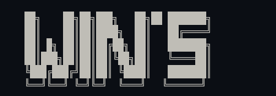

# Wins's
## Description

A brief description of your project.

## Installation

To install and run the project, follow these steps:

### Clone the Repository

``bash
git clone https://github.com/erwineka123/WinS.git
